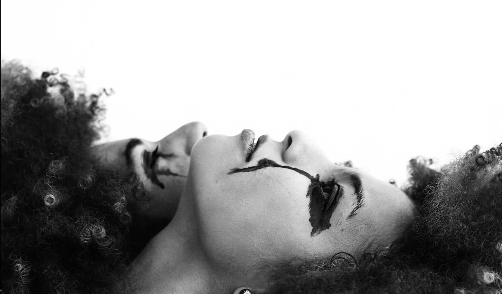

<!-- below custom font may not work although great practice and fun to see it in preview on local -->

# 
Beautiful Dark Days

##### *basic html/css website in hybrid halloween/personal theme to have sensible reason to use dark beautiful image*

 

### **HOW WORKS**
- scroll to bottom and play audio 
- skim layout/design back to top
- read limited real body content
- select delightful code language
- enter name & year(s) and submit
- visit additional online presence(s)

 

### **NEXT STEP**
- add note input field not wired to db
- wire audio to auto play on mute for user
- migrate personal info to separate site
- bump up overall halloween/dark theme
- set media queries for best presentation

 

